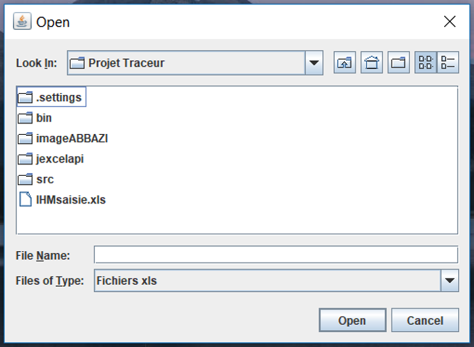

# Graph Plotter
## Master's Degree projects (July 2012)

Graph Plotter is a program written in Java with a Human Machine Interface (HMI)

### How to use it:
To run the program execute _**"TraceurJar2.jar"**_ by double-clicking it, 
Go to > **A propos** > **Comment Utiliser** (to read about how to use the HMI) 
After that you can select **Commencer** on the upper-left corner to Start.

The HMI allows the user to plot any graph by providing the values of _x_ and _y_ manually:

or by using an excel file: 

